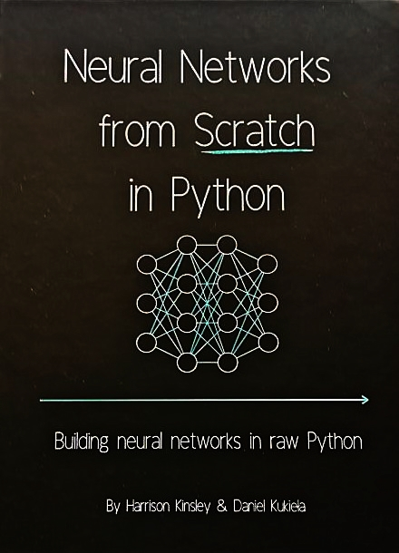

# Neural-Networks-From-Scratch-in-Python

This will be my walk through of the book "Neural Networks from Scratch in Python" by Harrison Kinsely &amp; Daniel Kukiela

I have created a local conda environment for this book:

 1) mamba create -n nnfsip python=3.11
 2) mamba activate nnfsip
 3) mamba install conda-forge::jupyterlab
 4) mamba install conda-forge::numpy

## Wednesday, July 10, 2024

There is a youtube video series [Neural Networks From Scratch](https://www.youtube.com/playlist?list=PLPTV0NXA_ZSj6tNyn_UadmUeU3Q3oR-hu) that got me going on this book, and I plan on pulling resources from this as I work through the book, into a [Vizuara](https://vizuara.ai/) folder that is the name of the company started by the author of the series, Dr. Raj Dandekar, an MIT phd grad. I kinda think this will be a real useful video series to actually go through.